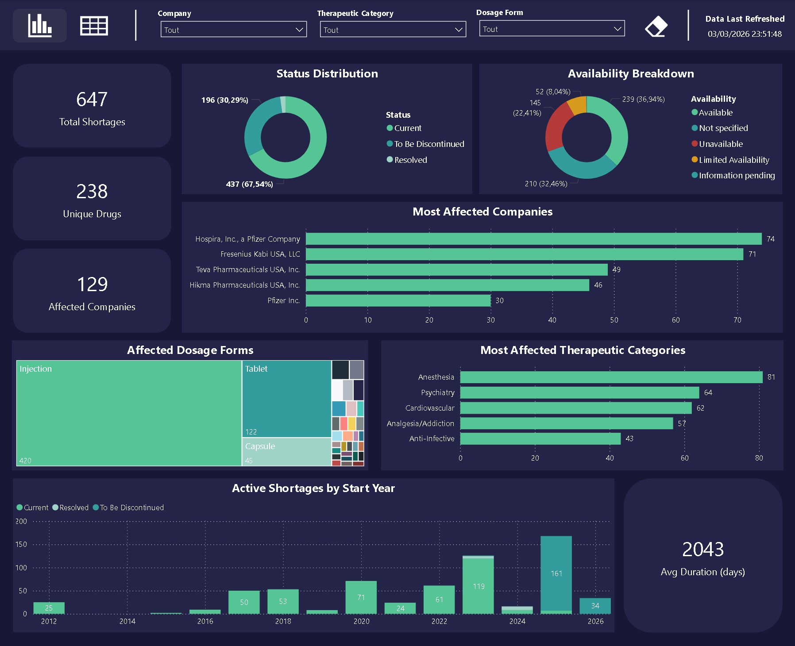
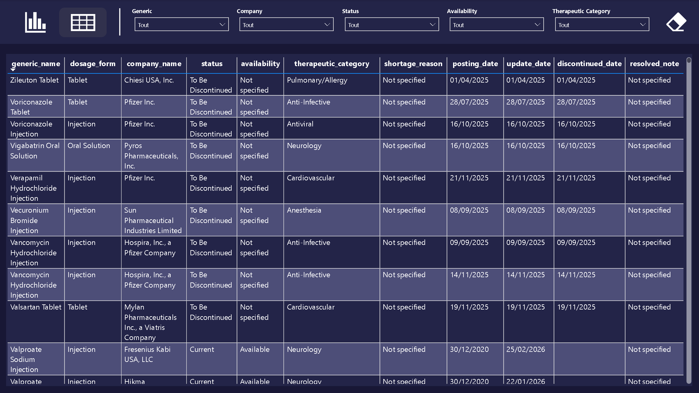

# FDA Drug Shortages: End-to-End Data Pipeline & Analytics

## Project Overview
This project is an end-to-end Data Engineering and Data Analytics portfolio piece. It automatically tracks and analyzes real-time drug shortages across the United States using the official government API. 

The goal is to provide supply chain directors and hospital administrators with an interactive dashboard to anticipate and manage critical medical shortages.

## Power BI Dashboard
*(Interactive dashboard providing daily insights on drug availability, impacted companies, and therapeutic categories).*

[**Click here to view the Interactive Dashboard**](https://app.powerbi.com/view?r=eyJrIjoiY2ZhNjIxNzYtMGFjOC00N2Q4LTliN2QtNjMyNTNmMjU0ZTFmIiwidCI6ImZlMDY5YmZhLWM4ZjYtNGEzNy04MDY0LTQ5ZjllYmNkMWQ5NiJ9&pageName=caeaf55598e05cb90301)

## Architecture & Tech Stack
This project follows a modern ETL (Extract, Transform, Load) cloud architecture:

1. **Extract (Python / Requests):** - Automated extraction from the official **FDA openAPI**.
   - Handles API pagination and dynamic limits.
2. **Transform (Python / Pandas):** - Data cleaning, deduplication, and handling of nested JSON lists.
   - **Data Quality:** Implemented fuzzy matching (`difflib`) to correct typos and standardize categorical variables dynamically.
3. **Load (Google Cloud Platform - BigQuery):** - Secure and automated loading into a Cloud Data Warehouse using Google Service Accounts.
4. **Automation / CI-CD (GitHub Actions):** - Fully automated daily cron job (Scheduled at 08:00 UTC) running on Ubuntu servers to ensure fresh data every morning.
5. **Data Visualization (Power BI):** - Direct Query / Import from BigQuery.
   - Advanced DAX measures and interactive visualizations.

## How it works (Automated Pipeline)
The Python script (`fda_pipeline.py`) is scheduled via `.github/workflows/pipeline.yml`. It runs daily without any manual intervention, ensuring the dashboard is always displaying up-to-date figures.

---
*Developed as a portfolio project to demonstrate proficiency in Python, Cloud Computing (GCP), and Data Visualization.*
